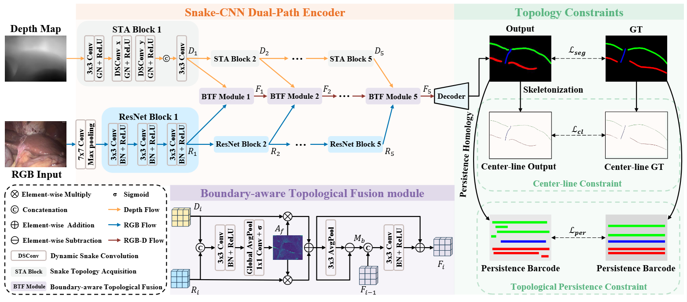

<div align=center>
<h1>[MICCAI'25]TopoNet: Topology-Constrained Learning for Efficient Laparoscopic Liver Landmark Detection</h1>

[**Ruize Cui**](https://scholar.google.com/citations?hl=en&user=rAcxfuUAAAAJ), **Jiaan Zhang**, [**Jialun Pei**](https://scholar.google.com/citations?user=1lPivLsAAAAJ&hl=en), **Kai Wang**, [**Pheng-Ann Heng**](https://scholar.google.com/citations?user=OFdytjoAAAAJ&hl=en), and [**Jing Qin**](https://harry-qinjing.github.io/)

**Contact:** ruize.cui@connect.polyu.hk, peijialun@gmail.com

<a href="https://arxiv.org/abs/2507.00519"></a>

Official Implementation of MICCAI 2025 paper "*Topology-Constrained Learning for Efficient Laparoscopic Liver Landmark Detection*"


</div>

## Environment preparation
The code is tested on python 3.9.19, pytorch 2.1.2, and CUDA 12.1, change the versions below to your desired ones.
1. Clone repository:
```shell
git clone https://github.com/cuiruize/TopoNet.git

cd TopoNet
```
   
2. Set up anaconda environment:
```shell
# Create DVPT anaconda environment from YAML.file
conda env create -f toponet.yaml
# Activate environment
conda activate TopoNet
```

3. Set up related module

Install fast BettiMatching implementation [[Bett-Matching-3D](https://github.com/nstucki/Betti-Matching-3D)]

Install surface-distance computing library [[surface-distance](https://github.com/google-deepmind/surface-distance)]

## Dataset preparation

### Download evaluation datasets
- L3D dataset: https://github.com/PJLallen/D2GPLand
- P2ILF dataset: https://p2ilf.grand-challenge.org/
### Register datasets
Change the path of the datasets as:
```shell
DATASET_ROOT = 'TopoNet/L3D/'
or
DATASET_ROOT = 'TopoNet/P2ILF/'
TRAIN_PATH = os.path.join(DATASET_ROOT, 'Train/')
TEST_PATH = os.path.join(DATASET_ROOT, 'Test/')
VAL_PATH = os.path.join(DATASET_ROOT, 'Val/')
```

## Pre-trained weightts

TopoNet weights: [Google Drive](https://drive.google.com/file/d/1dfvMlagKPOO3P3QswYns8JO5tLTj798r/view?usp=sharing)

Depth Anything V2 with vitb pre-trained weights: [Depth-Anything-V2](https://github.com/DepthAnything/Depth-Anything-V2)

## Train

```shell
python train.py --data_path {PATH_TO_DATASET} --depth_path {PATH_TO_DEPTH_MODEL_WEIGHTS} --save_path {PATH_TO_SAVE_RESULTS} --batch_size 4 --epoch 200
```

- {PATH_TO_DATASET}: path to your own dataset dir
- {PATH_TO_DEPTH_MODEL_WEIGHTS}: path to depth model weights
- {PATH_TO_SAVE_RESULTS}: path to save training results

## Eval

```shell
python test.py --model_path {PATH_TO_THE_MODEL_WEIGHTS} --data_path {PATH_TO_DATASET} --depth_path {PATH_TO_DEPTH_MODEL_WEIGHTS} --save_path {PATH_TO_SAVE_RESULTS}
```

- {PATH_TO_THE_MODEL_WEIGHTS}: path to the pre-trained model weights

## Acknowledgement
This work is based on:

- [Depth Anything V2](https://github.com/DepthAnything/Depth-Anything-V2)
- [Betti Matching](https://github.com/nstucki/Betti-matching); [Betti Matching 3D](https://github.com/nstucki/Betti-Matching-3D)
- [clDice](https://github.com/jocpae/clDice)
- [Dynamic Snake Convolution](https://github.com/YaoleiQi/DSCNet)

Thanks them for their great work!

## Citation

If this helps you, please cite this work:

```bibtex
@article{cui2025topology,
  title={Topology-Constrained Learning for Efficient Laparoscopic Liver Landmark Detection},
  author={Cui, Ruize and Zhang, Jiaan and Pei, Jialun and Wang, Kai and Heng, Pheng-Ann and Qin, Jing},
  journal={arXiv preprint arXiv:2507.00519},
  year={2025}
}
```
